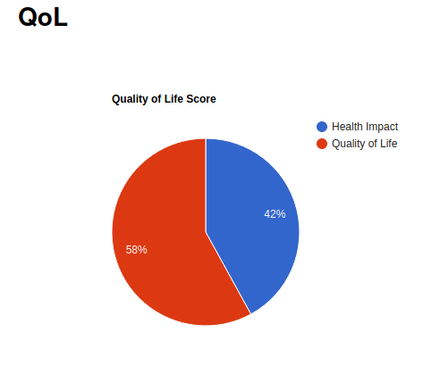
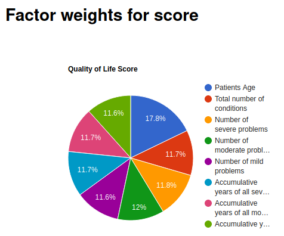
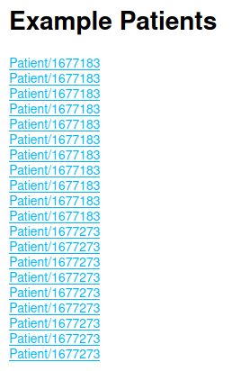

# QoL
Uses the FHIR api (`http://hapi.fhir.org/`) to calculate the current Quality of Life of a patient. 

Table of contents
=================

<!--ts-->
   * [How to run locally](#how-to-run-locally)
   * [How to run from Docker](#how-to-run-from-docker)
   * [Docker Cheatsheet](#Docker-Cheatsheet)
   * [How to Navigate the site](#navigate-the-site)
      * [Quality of Life (QoL) Score](#Quality-of-Life-(QoL)-Score)
      * [Explanation for Results](#Explanation-for-Results)
      * [Sample Patients](#Sample-Patients)
   * [REST API](#REST-API)
<!--te-->

How to run locally
==================
1. install nodeJS
1. Navigate to repo using terminal e.g. `cd /dir/to/repo/QoL`
1. in the terminal: `npm install`
1. in the terminal: `npm start`
1. in the browser (Chrome/Firefox/etc): `http://localhost:3000/`
1. in the browser (Chrome/Firefox/etc): `http://localhost:3000/Patient/<put Patient ID here>`

How to run from Docker
======================
**Build docker image**  
`docker build -t qol:latest .`

**Run Docker in detached head mode**  
`docker run -p 49160:3000 -d qol:latest`

**Make sure docker is running and find the `PORTS` mapped to host machine**    
`docker ps` will present something similar to below data

```
# Example output
CONTAINER ID        IMAGE               COMMAND                  CREATED             STATUS              PORTS                     NAMES
19bad986b95b        qol:latest          "docker-entrypoint.s…"   4 minutes ago       Up 4 minutes        0.0.0.0:49160->3000/tcp   optimistic_blackburn
```
In the example above under `PORTS` you can see `0.0.0.0:49160->3000/tcp`, Docker mapped the `3000` port inside of the container to the port `49160` on your machine.   
 
This means on your host computer you can navigate to `http://0.0.0.0:49160/` to test out the app. You can also use: `http://localhost:49160/` to access the site.

To find QoL for specific patient: `http://0.0.0.0:49160/Patient/<put Patient ID here>` e.g. `http://0.0.0.0:49160/Patient/1188890`

To inspect the server logs take the `docker logs <CONTAINER ID>` an example using the above data `docker logs 19bad986b95b`

Docker Cheatsheet
=================
```
docker ps                                 # Get info on containers that are running
docker stop <CONTAINER ID>                # Stop container using container id found with "docker ps"
docker images                             # Show a list of all images on system
docker rmi <IMAGE ID>                     # Delete an image pass the ID returned by "docker images" to "docker rmi". If image is being used then "docker rm <stopped container>"
docker ps -a                              # Get info on all containers
docker logs <container id>                # Print app output
docker exec -it <container id> /bin/bash  # Enter the container
```

Navigate the site
=================

Quality of Life (QoL) Score
---------------------------
Below is an example of the Quality of Life (QoL) Score. The "Health Impact" shows the negative impact the patient experiences due to various illnesses and health conditions. Ideally, patients want to have small to no "Health Impact". The smaller the "Health Impact" the greater the over all Quality of Life.




Explanation for Results
-----------------------
Results calculated using a patient's medical data pulled using the FHIR api.

Below are factors used to calculate QoL score
* **Patient's age**: Reasoning: older people tend to have more problems, the weight of their problems is less. Younger peoples with longer lasting severe health problems have a bigger impact on QoL.
* **Total number of conditions:** Reasoning: The more problems a person has the worse their QoL tends to be. Person with many health problems has a lot more to deal with.
    * **Sever Problems:** Reasoning: Sever conditions have the greatest impact on health
    * **Moderate Problems:** Reasoning: Moderate conditions impact on health is between Severe and Mild
    * **Mild Problems:** Reasoning: This has the least impact, but many small problems still can add up.
* **Accumulative:** Reasoning: this measure the amount of time the patient has been inflected with the problem. The longer the inflection the greater the impact on QoL. This takes into account the severity of the conditions as well.



Sample Patients
---------------
The site pulls a list of patients with various conditions and gives clickable links for user to test.  

If you have a specific patient ID you would like to get a QoL score for, you can by navigating to: `http://localhost:3000/patient/<put id number here>`



REST API
========

**Return data for specific patient**  
`http://localhost:3000/api/patient/<put id number here>` e.g. `http://localhost:3000/api/Patient/1182759`

**Return data for default patient**  
`http://localhost:3000/api`